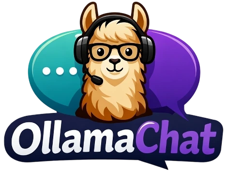

# OllamaChat

<p align="center">
  
</p>

A self-hosted ChatGPT-style web app that runs on your machine using [Ollama](https://ollama.ai/). No cloud APIs, no API keys your data stays local.

## Features

- **Chat interface**: streaming responses, markdown with syntax highlighting, conversation history
- **Smart model routing**: "Auto" mode picks the best model per prompt (code → coder model, complex reasoning → larger model, general → fast default)
- **Dark mode**: mobile-responsive, conversation management

## Setup

### 1. Install Ollama

```bash
brew install ollama   # or download from ollama.ai
ollama serve          # or open the desktop app
```

### 2. Pull models

```bash
ollama pull qwen2.5:14b           # default chat model (~9GB)

# Optional — used by smart router
ollama pull qwen2.5-coder:14b     # coding tasks
ollama pull qwen2.5:32b           # complex reasoning (needs ~20GB RAM)
```

### 3. Run

```bash
cd web
pnpm install
pnpm dev
```

Open [http://localhost:3000](http://localhost:3000). The SQLite database is created automatically.

## Customizing

- **Swap models**: any model from [ollama.ai/library](https://ollama.ai/library) works. Pull it and it appears in the dropdown. Change the default in `prisma/schema.prisma`.
- **Routing logic**: edit `src/lib/router.ts` to change which patterns trigger which models.
- **System prompt**: modify `src/app/api/chat/route.ts` to prepend instructions to every conversation.
- **Remote Ollama**: set `OLLAMA_BASE_URL` in `.env` to point at a GPU server running Ollama.

## Stack

Next.js 16 · React 19 · Tailwind v4 · TypeScript · Prisma v7 + SQLite · Ollama API
